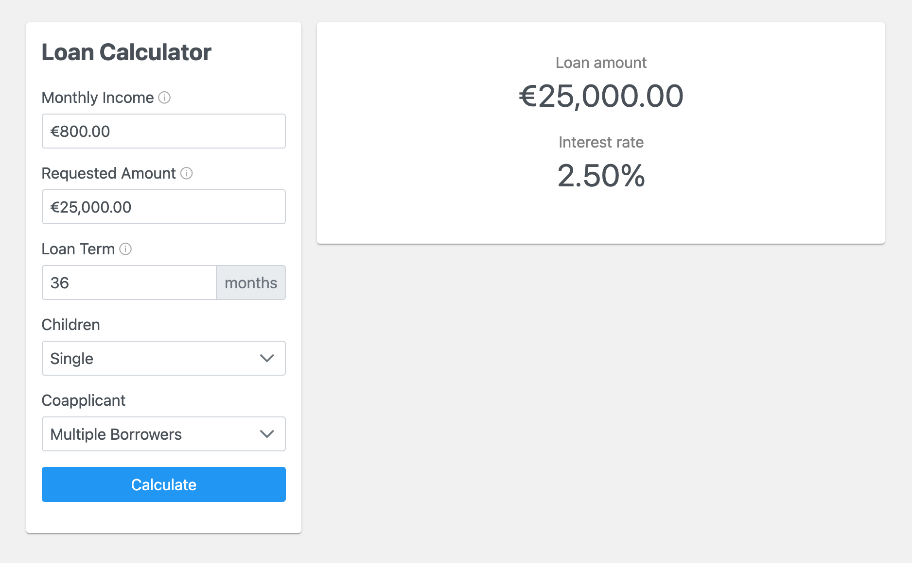

# LoanCalculator

LoanCalculator is a simple calculator built with Angular to demonstrate a number of features, such as component
interaction, form validation, and error handling.

## Usage

Run `ng serve` for a dev server. Navigate to `http://localhost:4200/`. The app will automatically reload if you change
any of the source files.

## Build

Run `ng build` to build the project. The build artifacts will be stored in the `dist/` directory.

## Running unit tests

Run `ng test` to execute the unit tests via [Karma](https://karma-runner.github.io).

## Built with

* [Angular (12.2.11)](https://angular.io/)
* [PrimeNG (12.2.1)](https://www.primefaces.org/primeng/)
* [PrimeFlex (3.1.0)](https://primefaces.org/primeflex/)
